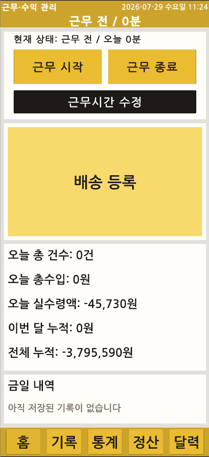
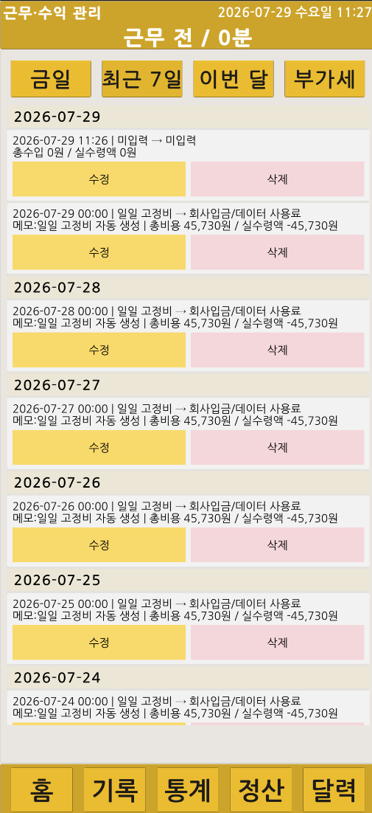
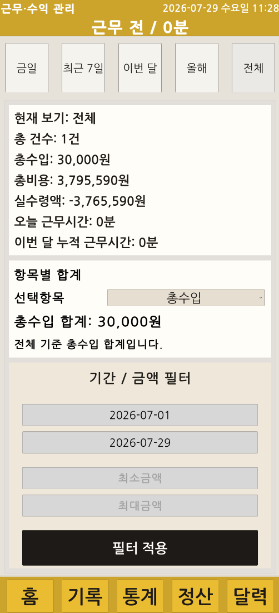
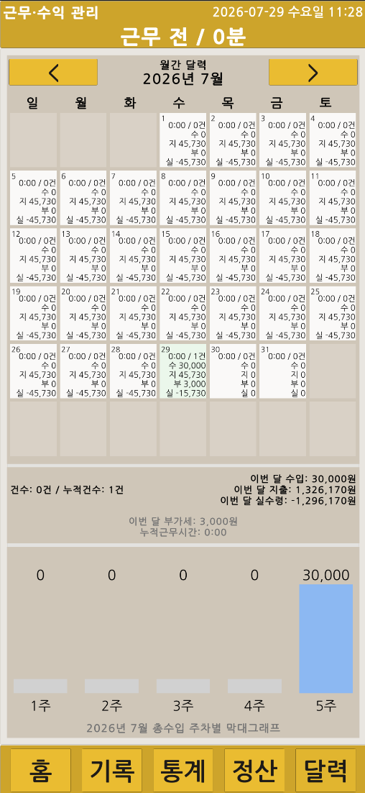
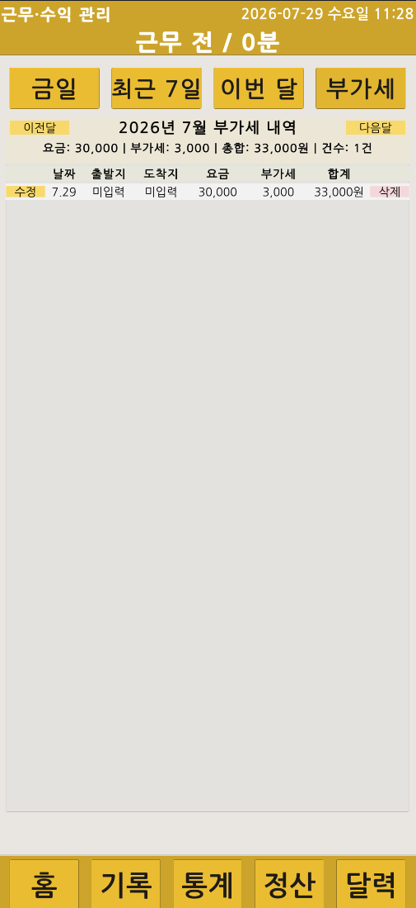
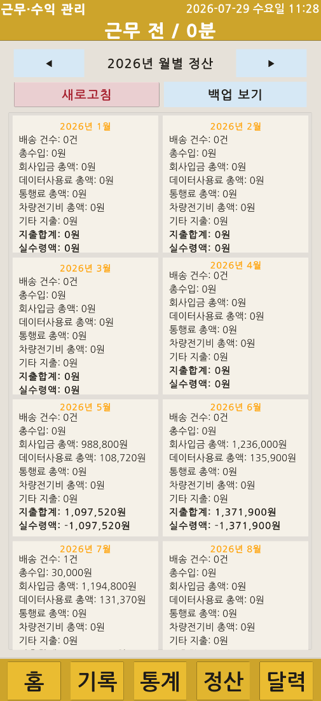
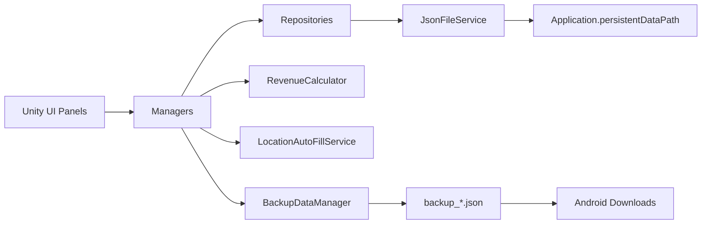

# Quik Delivery

> Unity 기반 배달 수입·근무·정산 관리 앱

  

## 프로젝트 정보

| 항목 | 내용 |
|---|---|
| 프로젝트 유형 | 개인 프로젝트 |
| 개발 기간 | 2026.05 ~ 2026.07 |
| 개발 환경 | Unity 6000.3.15f1, C# |
| 실행 환경 | Android |
| 저장 방식 | JSON, `Application.persistentDataPath` |
| 주요 기능 | 배송 기록, 근무시간, 통계, 캘린더, 부가세, 월별 정산, 백업·복원 |
| 검증 상태 | Android 실기기 설치·실행 및 백업 파일 생성·내보내기 확인 |

## 프로젝트 개요

실제 배달 업무에서 발생하는 배송 기록, 수입과 비용, 근무시간, 부가세, 월별 정산을 하나의 모바일 화면에서 관리하기 위해 제작한 Unity Android 앱입니다.

배송이 없는 날짜에도 발생하는 고정비를 누락하지 않도록 일일 고정비 레코드를 별도로 생성하고, 배송 건수와 비용 집계 기준을 분리했습니다. 데이터는 기기 내부 JSON 파일로 저장하며 전체 백업 생성, 다운로드 폴더 내보내기와 복원 흐름을 제공합니다.

## Android 실기기 시연

Android 기기에 APK를 설치해 배송 입력·수정·삭제, 통계, 캘린더, 월 정산과 백업 파일 생성을 확인했습니다.

<!-- QUIK_DELIVERY_DEMO_URL -->

전체 화면 자료는 [실기기 시연 문서](docs/demo/README.md)에서 확인할 수 있습니다.

## 핵심 기능

### 배송 기록 등록·수정·삭제

출발지·도착지, 날짜·시간, 기본 요금, 부가세 대상 금액, 추가 요금과 각종 비용을 입력하고 계산 결과를 즉시 확인합니다.

| 배송 기록 입력 | 오늘 배송 기록 |
|---|---|
|  |  |

| 최근 배송 기록 | 실기기 수정·삭제 |
|---|---|
|  |  |

### 근무시간과 통계

근무 시작·종료를 기록하고 날짜와 시간을 직접 보정할 수 있습니다. 오늘·주간·월간·연간·전체·직접 기간을 기준으로 배송 건수와 수입·비용·실수령을 집계합니다.

| 통계 요약 | 기간·금액 필터 |
|---|---|
|  |  |

### 캘린더와 부가세

월간 캘린더에서 일별 근무시간·배송 건수·수입·비용·부가세를 확인하고, 선택한 날짜의 기록 목록으로 이동합니다. 부가세 대상 기록은 월별 표로 분리해 조회합니다.

| 캘린더 분석 | 부가세 기록 |
|---|---|
|  |  |

### 연도별 월 정산

선택 연도의 1월부터 12월까지 배송 건수, 총수입, 비용 항목과 실수령을 월별 카드로 표시합니다.

  

### JSON 백업·복원

배송 기록과 근무 세션을 하나의 백업 파일로 생성하고, Android 다운로드 폴더로 내보내거나 선택한 백업 파일에서 복원합니다.

  

## Android 실기기 확인

| 홈 대시보드 | 배송 기록 입력 | 통계 분석 |
|---|---|---|
|  |  |  |

| 월 정산 | 캘린더 분석 | APK·백업 파일 |
|---|---|---|
|  |  |  |

## 시스템 구조

- **UI**: Home, Delivery Input/List, Stats, Calendar, Settlement, Settings
- **Managers**: 화면 흐름, 배송·근무·정산·백업 상태 관리
- **Repositories**: 배송 기록, 근무 세션, 설정 데이터 저장
- **Services**: JSON 파일 처리, 수익 계산, 위치 자동 입력
- **Storage**: Android 기기 내부 저장소와 다운로드 폴더

## 데이터 흐름

| 흐름 | 처리 |
|---|---|
| 배송 저장 | 입력값 검증 → 수입·비용·부가세 계산 → JSON 저장 → 연결 화면 갱신 |
| 근무 기록 | 시작·종료 또는 수동 수정 → 근무 세션 저장 → 홈·통계·캘린더 반영 |
| 월 정산 | 연도 선택 → 월별 기록 조회 → 12개 요약 카드 갱신 |
| 고정비 보정 | 기준 시작일부터 오늘까지 누락일 검색 → 일일 고정비 레코드 추가 |
| 백업 | 배송·근무 데이터 통합 → `backup_*.json` 생성 → 다운로드 폴더 내보내기 |
| 복원 | 백업 파일 선택 → 전체 데이터 저장 → 누락 고정비 재확인 → 화면 갱신 |

## 문제 해결

| 문제 | 처리 | 결과 |
|---|---|---|
| 배송 0건 날짜의 고정비 누락 | 기준일부터 오늘까지 날짜를 순회하고 고정비 레코드 존재 여부 확인 | 앱을 실행하지 않은 날짜도 정산에 반영 |
| 고정비가 배송 건수에 포함됨 | 실제 배송 판정과 비용 레코드 집계를 분리 | 건수와 수익·비용 통계의 의미 유지 |
| 정산 UI의 런타임 생성 구조가 겹침 | Edit Mode Builder와 12개월 카드 컴포넌트로 레이아웃·참조 구성 | 월별 카드 가독성과 유지보수 개선 |
| Android 백업 접근 방식 차이 | 내부 저장, 파일 선택, 다운로드 내보내기를 분리 | 기기에서 백업 생성·복원 흐름 확인 |

## 검증 범위

- `MainScene`에서 주요 패널 전환과 데이터 갱신 확인
- 배송 기록 등록·수정·삭제 확인
- 오늘·주간·월간·연간·전체·직접 기간 집계 확인
- 캘린더 일별 요약과 선택 날짜 기록 이동 확인
- 부가세 대상 기록과 월별 합계 확인
- 연도별 12개월 정산 카드 확인
- 누락된 일일 고정비 자동 생성 확인
- JSON 전체 백업·복원과 다운로드 내보내기 확인
- Android 실기기 설치·실행 확인
- 실제 주소·금액·원본 JSON과 APK는 공개 저장소에서 제외

## 기술 스택

| 구분 | 기술 |
|---|---|
| Engine | Unity 6000.3.15f1 |
| Language | C# |
| UI | Unity uGUI, TextMesh Pro |
| Data | JSON, `Application.persistentDataPath` |
| Android | APK 빌드, 파일 선택, 다운로드 내보내기 |
| Architecture | Data / Services / Repositories / Managers / UI |
| Version Control | Git, GitHub |

## 현재 범위와 제한

- 서버·클라우드 동기화 없이 단일 기기 JSON 저장을 사용합니다.
- 저장 파일 암호화와 사용자 계정 기능은 적용하지 않았습니다.
- Android 버전과 제조사에 따라 파일 선택·다운로드 경로 동작이 달라질 수 있습니다.
- 자동화된 단위·통합 테스트보다 시나리오 기반 수동 검증을 중심으로 확인했습니다.
- 앱 스토어 배포와 다중 사용자 운영은 현재 범위에 포함하지 않습니다.

## 상세 문서

| 문서 | 내용 |
|---|---|
| [Documentation](docs/README.md) | 상세 문서 전체 목차 |
| [01. Overview](docs/01-overview.md) | 배경, 목표와 구현 범위 |
| [02. Architecture](docs/02-architecture.md) | 계층 구조와 책임 |
| [03. Features](docs/03-features.md) | 기능별 구현과 화면 |
| [04. Data Flow](docs/04-data-flow.md) | 저장·집계·백업 흐름 |
| [05. Validation](docs/05-validation.md) | 검증 범위와 실기기 확인 |
| [06. Known Issues](docs/06-known-issues.md) | 현재 제한과 개선 방향 |
| [07. Project Structure](docs/07-project-structure.md) | 저장소와 Unity 프로젝트 구조 |
| [Demo](docs/demo/README.md) | Android 실기기 시연 자료 |

## 공개 범위

이 저장소에는 Unity 프로젝트 소스와 비식별화한 화면 자료만 포함합니다. 실제 배송 주소, 개인 메모, 수입 원본 데이터, 백업 JSON, APK 파일과 서명 정보는 공개하지 않습니다.
