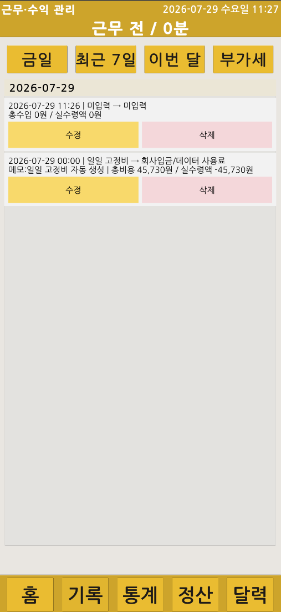
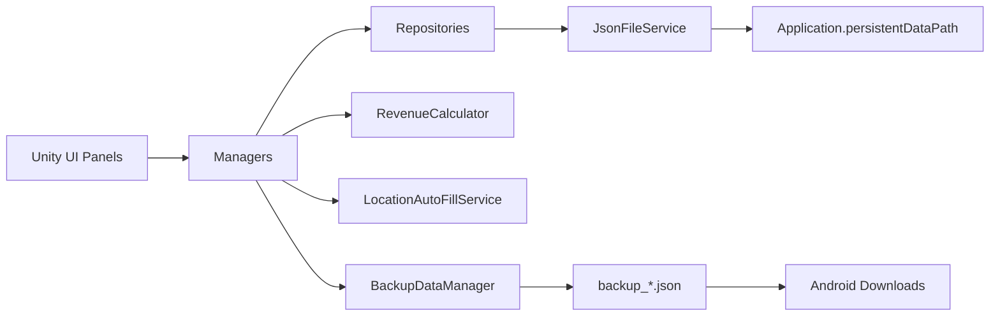

# Quik Delivery

> Unity 기반 배달 수입·근무·정산 관리 Android 앱

  

## 프로젝트 정보

| 항목 | 내용 |
|:---|:---|
| 프로젝트 유형 | 개인 프로젝트 |
| 개발 기간 | 2026.05 ~ 2026.07 |
| 개발 환경 | Unity 6000.3.15f1, C# |
| 실행 환경 | Android |
| 저장 방식 | JSON, `Application.persistentDataPath` |
| 주요 기능 | 배송 기록, 근무시간, 통계, 캘린더, 부가세, 월별 정산, 백업·복원 |
| 검증 환경 | Unity Play Mode, Android 실기기 |
| 검증 결과 | APK 설치·실행, 주요 기능 동작, 백업 파일 생성·내보내기 확인 |

## 프로젝트 개요

실제 배달 업무에서 발생하는 배송 기록, 수입과 비용, 근무시간, 부가세와 월별 정산을 하나의 모바일 앱에서 관리하기 위해 제작했습니다.

배송이 없는 날짜에도 발생하는 일일 고정비가 정산에서 누락되지 않도록 기준 시작일부터 오늘까지 누락된 고정비 레코드를 확인해 생성합니다. 고정비 레코드는 비용 집계에는 포함하되 실제 배송 건수에서는 제외해 통계의 의미를 유지했습니다.

배송 기록과 근무 세션은 Android 기기 내부 JSON 파일로 저장하며, 전체 백업 생성, 다운로드 폴더 내보내기와 선택한 백업 파일 복원 흐름을 구현했습니다.

## Android 실기기 시연

Android 기기에 APK를 설치해 배송 기록 생성·조회·수정·삭제, 기간 통계, 캘린더, 부가세, 연도별 월 정산과 백업 파일 생성을 확인했습니다.

https://github.com/user-attachments/assets/52ec2404-edb2-441d-b28f-89d596c0a819

전체 화면 자료는 [Android 실기기 시연 문서](docs/demo/README.md)에서 확인할 수 있습니다.

## 핵심 기능

### 배송 기록 관리

출발지·도착지, 날짜·시간, 기본 요금, 부가세 대상 금액, 추가 요금과 비용을 입력하고 총수입·총비용·부가세·실수령을 계산합니다. 저장된 기록은 기존 식별자를 유지하면서 수정하거나 삭제할 수 있습니다.

<table>
  <tr>
    <td width="50%" align="center"></td>
    <td width="50%" align="center"></td>
  </tr>
  <tr>
    <td align="center">배송 기록 입력</td>
    <td align="center">오늘 배송 기록</td>
  </tr>
</table>

<table>
  <tr>
    <td width="50%" align="center"></td>
    <td width="50%" align="center"></td>
  </tr>
  <tr>
    <td align="center">최근 배송 기록</td>
    <td align="center">Android 실기기 수정·삭제</td>
  </tr>
</table>

### 근무시간과 기간별 통계

근무 시작·종료를 기록하고 잘못 입력한 날짜와 시간을 직접 보정할 수 있습니다. 오늘·주간·월간·연간·전체·직접 기간을 기준으로 배송 건수, 수입, 비용과 실수령을 집계하며 최소·최대 금액 조건을 함께 적용할 수 있습니다.

<table>
  <tr>
    <td width="50%" align="center"></td>
    <td width="50%" align="center"></td>
  </tr>
  <tr>
    <td align="center">기간별 통계 요약</td>
    <td align="center">기간·금액 조건 필터</td>
  </tr>
</table>

### 캘린더와 부가세

월간 캘린더에서 날짜별 근무시간, 배송 건수, 수입, 비용, 실수령과 부가세를 확인하고 선택한 날짜의 기록 목록으로 이동합니다. 부가세 대상 기록은 월별 목록과 합계로 분리해 확인합니다.

<table>
  <tr>
    <td width="50%" align="center"></td>
    <td width="50%" align="center"></td>
  </tr>
  <tr>
    <td align="center">월간 캘린더 분석</td>
    <td align="center">부가세 대상 기록</td>
  </tr>
</table>

### 연도별 월 정산

이전·다음 연도로 이동하면서 선택한 연도의 1월부터 12월까지 배송 건수, 총수입, 비용 항목과 실수령을 고정된 12개 월별 카드로 확인합니다.

  

### 일일 고정비 보정

기준 시작일부터 오늘까지 날짜를 순회해 일일 고정비 레코드가 없는 날짜를 확인합니다. 누락된 날짜에는 고정비 레코드를 생성하고 전체 데이터를 한 번 저장합니다.

고정비 레코드는 비용과 실수령 계산에는 포함하지만 실제 배송 건수에서는 제외합니다.

### JSON 백업·복원

배송 기록과 근무 세션을 하나의 `backup_*.json` 파일로 생성합니다. Android에서는 최신 백업을 다운로드 폴더로 내보내고, 파일 선택창에서 선택한 백업 파일을 복원할 수 있습니다.

  

## 시스템 구조

| 계층 | 역할 |
|:---|:---|
| Data | 배송 기록, 근무 세션, 정산 기록, 앱 설정과 요금 규칙 정의 |
| Services | JSON 파일 처리, 수익·비용 계산, 위치 자동 입력 |
| Repositories | 배송 기록, 근무 세션과 설정 데이터 저장 |
| Managers | 배송·근무·정산·백업 업무 규칙과 화면 갱신 관리 |
| UI | 홈, 배송 입력·목록, 통계, 캘린더, 정산과 설정 화면 |
| Storage | Android 기기 내부 저장소와 다운로드 폴더 |

## 데이터 흐름

| 흐름 | 처리 |
|:---|:---|
| 배송 저장 | 입력값 검증 → 수입·비용·부가세 계산 → JSON 저장 → 연결 화면 갱신 |
| 근무 기록 | 시작·종료 또는 수동 수정 → 근무 세션 저장 → 홈·통계·캘린더 반영 |
| 월별 정산 | 연도 선택 → 월별 배송 기록 조회 → 12개 요약 카드 갱신 |
| 고정비 보정 | 기준 시작일부터 오늘까지 누락일 확인 → 일일 고정비 레코드 생성 |
| 백업 | 배송·근무 데이터 통합 → `backup_*.json` 생성 → 다운로드 폴더 내보내기 |
| 복원 | 백업 파일 선택 → 데이터 저장 → 누락 고정비 재확인 → 연결 화면 갱신 |

## 주요 문제와 해결

| 문제 | 원인 | 해결 방법 | 결과 |
|:---|:---|:---|:---|
| 배송이 없는 날짜의 고정비 누락 | 배송 기록이 생성된 날짜를 중심으로 비용이 저장됨 | 기준일부터 오늘까지 날짜를 순회해 누락된 고정비 레코드 생성 | 앱을 실행하지 않았던 날짜의 고정비도 정산에 반영 |
| 고정비가 배송 건수에 포함됨 | 배송과 고정비가 같은 기록 목록에서 집계됨 | `IsDailyFixedExpense`로 고정비를 구분하고 실제 배송 판정에서 제외 | 배송 건수와 비용 집계의 의미를 분리 |
| 월별 정산 UI 구성 요소가 겹침 | 런타임 생성과 참조 설정이 한 과정에 섞여 있음 | Edit Mode Builder와 12개 `MonthlySummaryCardUI`로 레이아웃과 참조 구성 | 1월부터 12월까지 고정된 카드 배치와 갱신 구조 확보 |
| Android 백업 경로 처리 방식이 다름 | 내부 저장소, 다운로드 폴더와 파일 선택창의 접근 방식이 다름 | 백업 생성, 다운로드 내보내기와 파일 선택 복원 흐름을 분리 | Android 실기기에서 백업 생성·내보내기·복원 흐름 확인 |

## 검증 결과

| 영역 | 검증 항목 | 결과 |
|:---|:---|:---:|
| 앱 실행 | `MainScene` 실행과 주요 패널 전환 | PASS |
| 배송 기록 | 생성·조회·수정·삭제와 계산 결과 반영 | PASS |
| 근무시간 | 시작·종료와 날짜·시간 수동 보정 | PASS |
| 통계 | 기간·금액 필터와 수입·비용·실수령 집계 | PASS |
| 캘린더 | 날짜별 요약, 주간 차트와 기록 목록 이동 | PASS |
| 부가세 | 대상 기록과 월별 합계 | PASS |
| 월 정산 | 이전·다음 연도 이동과 12개월 카드 | PASS |
| 고정비 | 기준일부터 오늘까지 누락일 자동 생성 | PASS |
| 백업 | 전체 백업 생성과 다운로드 폴더 내보내기 | PASS |
| 복원 | 선택한 백업 파일 저장과 연결 화면 갱신 | PASS |
| Android | APK 설치 후 주요 기능 흐름 실행 | PASS |

<table>
  <tr>
    <td width="50%" align="center"></td>
    <td width="50%" align="center"></td>
  </tr>
  <tr>
    <td align="center">Android 실기기 홈 화면</td>
    <td align="center">Android 실기기 월별 정산</td>
  </tr>
</table>

  

## 기술 스택

| 기술 | 버전 | 용도 |
|:---|---:|:---|
| Unity | 6000.3.15f1 | Android 앱 개발과 UI 구성 |
| Unity uGUI | 2.0.0 | 모바일 화면과 입력 UI |
| TextMesh Pro | Unity Package | 텍스트 표시와 입력 |
| Unity Native File Picker | Git Package | Android 백업 파일 선택 |
| JSON | Unity 직렬화 | 배송·근무·설정과 백업 데이터 저장 |
| Git·GitHub | - | 버전 관리와 포트폴리오 문서 운영 |

## 상세 문서

| 문서 | 내용 |
|:---|:---|
| [문서 목차](docs/README.md) | 상세 문서 전체 목차 |
| [01. Overview](docs/01_overview.md) | 개발 배경, 목적, 구현 범위와 최종 결과 |
| [02. Architecture](docs/02_architecture.md) | 계층 구조, 주요 구성 요소와 데이터 저장 구조 |
| [03. Features](docs/03_features.md) | 배송·근무·통계·캘린더·정산과 백업 기능 |
| [04. Data Flow](docs/04_data_flow.md) | JSON 저장, 정산, 고정비와 백업·복원 흐름 |
| [05. Validation](docs/05_validation.md) | 기능 검증과 Android 실기기 확인 |
| [06. Project Scope](docs/06_project_scope.md) | 주요 문제 해결과 최종 구현 범위 |
| [07. Project Structure](docs/07_project_structure.md) | 저장소와 Unity 프로젝트 구조 |
| [Android Demo](docs/demo/README.md) | Android 실기기 영상과 화면 자료 |

## 공개 범위

이 저장소에는 Unity 프로젝트 소스와 개인정보가 없는 공개용 화면 자료만 포함합니다. 실제 배송 주소, 개인 메모, 수입 원본 데이터, 백업 JSON, APK 파일과 Android 서명 정보는 공개하지 않습니다.
