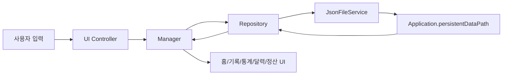
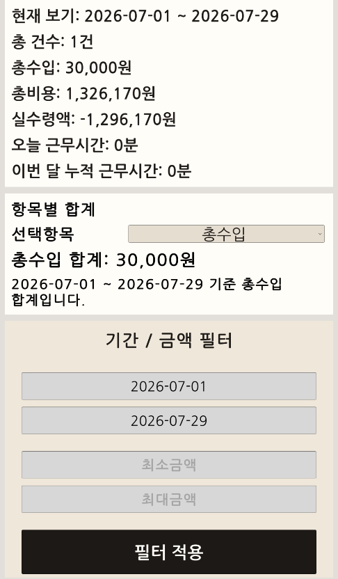

# Quik Delivery

> Unity 기반 배송 업무·수익·월별 정산 관리 Android 앱

Quik Delivery는 실제 배송 업무에서 발생하는 **배송 기록, 근무시간, 수입·비용, 부가세 조회, 달력 분석, 월별 정산, 로컬 백업·복원**을 하나의 모바일 화면 흐름으로 관리하기 위해 만든 개인 프로젝트입니다.

단순한 입력 화면에 그치지 않고, 기록 생성부터 계산·저장·조회·복원까지 이어지는 데이터 흐름을 Unity와 C#으로 직접 설계했습니다. 특히 배송이 없는 날에는 일일 고정비가 기록되지 않아 월별 데이터가 맞지 않던 문제를 발견하고, 기존 기록을 변경하지 않으면서 누락 날짜만 안전하게 보정하는 구조를 추가했습니다.

## 프로젝트 정보

| 항목 | 내용 |
|---|---|
| 프로젝트 구분 | 개인 프로젝트 |
| 개발 기간 | 2026.05 ~ 2026.07 |
| 플랫폼 | Android |
| 엔진 | Unity 6 (6000.3.10f1 기준) |
| 언어 | C# |
| UI | Unity uGUI, TextMeshPro |
| 데이터 저장 | JSON, `Application.persistentDataPath` |
| Android 파일 연동 | NativeFilePicker, MediaStore/Download 내보내기 |
| 상태 | 주요 기능 구현 및 APK 빌드 완료, 기존 앱 덮어쓰기 업데이트 검증은 최종 확인 항목 |

## 핵심 기능

- 배송 기록 추가·수정·삭제
- 날짜·시간·금액 입력 보정과 실시간 수익 계산
- 근무 시작·종료 및 날짜별 근무시간 수정
- 오늘·최근 7일·월·연·전체 통계
- 금액 및 기간 필터 기반 분석
- 월별 부가세 기록 조회
- 달력 기반 일별 기록과 주간 막대 그래프
- 연도별 1월~12월 월별 정산 카드
- 배송 0건 날짜의 일일 고정비 누락 자동 보정
- JSON 전체 백업·내보내기·불러오기
- 백업 복원 후 누락 고정비 재검사

## 시스템 구조



### 주요 책임 분리

| 계층 | 대표 클래스 | 역할 |
|---|---|---|
| Data | `DeliveryRecord`, `WorkSession`, `AppSettings` | 저장 데이터 모델 |
| UI | `DeliveryInputPanelUI`, `StatsPanelUI`, `SettlementPanelUI` | 입력·표시·사용자 이벤트 |
| Manager | `DeliveryManager`, `WorkSessionManager`, `BackupDataManager` | 업무 규칙과 흐름 제어 |
| Repository | `DeliveryRepository`, `WorkSessionRepository` | JSON 저장 목록 읽기·쓰기 |
| Service | `RevenueCalculator`, `JsonFileService`, `LocationAutoFillService` | 계산·파일·위치 기능 |

## 주요 화면

> 아래 화면은 포트폴리오 공개용 테스트 데이터 기준입니다.

<table>
  <tr>
    <td align="center"><strong>홈 / 근무 관리</strong><br></td>
    <td align="center"><strong>배송 등록</strong><br></td>
  </tr>
  <tr>
    <td align="center"><strong>기록 조회</strong><br></td>
    <td align="center"><strong>통계 및 필터</strong><br></td>
  </tr>
  <tr>
    <td align="center"><strong>월별 정산</strong><br></td>
    <td align="center"><strong>달력 분석</strong><br></td>
  </tr>
</table>

### 추가 화면

- 근무시간 수정: `images/features/work-time-edit.png`
- 오늘 기록: `images/features/records-today.png`
- 부가세 빈 상태: `images/features/vat-empty.png`
- 부가세 기록: `images/features/vat-record.png`
- 통계 전체 화면: `images/features/stats-overview.png`
- 백업 패널: `images/backup/backup-panel.png`

## 대표 문제 해결

### 1. 배송이 없는 날짜의 고정비 누락

**문제**  
기존 로직은 배송 기록을 저장하거나 수정할 때만 일일 고정비를 생성했습니다. 배송이 0건인 날에는 생성 진입점이 없어 월별 비용이 실제 운영 기준과 맞지 않았습니다.

**해결**  
`2026-05-08`부터 현재 날짜까지 전체 기록을 한 번 로드하고, `IsDailyFixedExpense` 날짜를 `HashSet`으로 수집한 뒤 누락된 날짜에만 새 기록을 추가했습니다. 신규 항목이 있을 때만 전체 목록을 한 번 저장하도록 했습니다.

**결과**  
기존 배송기록을 수정하거나 삭제하지 않고 누락분만 보정할 수 있으며, 앱 재실행·포커스 복귀·자정 변경·백업 복원 뒤에도 같은 날짜에 중복 기록이 생기지 않습니다.

### 2. 고정비와 배송 건수의 집계 기준 분리

고정비 기록은 비용과 실수령액에는 포함되어야 하지만 실제 배송 건수에는 포함되면 안 됩니다. `IsDailyFixedExpense`를 기준으로 배송 건수에서 제외하고, 회사입금·데이터사용료 등 비용 합계에는 포함하도록 요약 계산을 분리했습니다.

### 3. 런타임 정산 UI의 앵커 겹침

초기 월별 정산 화면은 런타임 생성 방식이라 버튼과 백업 영역의 앵커를 미세 조정하기 어려웠습니다. 다른 패널의 런타임 기록·부가세 UI는 유지하고, **정산 패널만 Edit Mode 고정 구조**로 변경했습니다. 12개월 카드는 2열 Grid로 배치하고 연도 이동과 백업 토글을 Inspector 참조 방식으로 연결했습니다.

### 4. 기존 데이터를 보존하는 백업 복원

배송기록과 근무기록을 하나의 백업 JSON으로 묶고 Android 파일 선택을 통해 복원하도록 구성했습니다. 복원 데이터 저장 직후 누락 고정비 보정을 실행하지만, 원본 백업 파일과 기존 레코드 자체는 변환하지 않습니다.

## 화면 구성

| 화면 | 주요 기능 |
|---|---|
| 홈 | 근무 상태, 오늘/월간 요약, 근무 시작·종료 |
| 배송 등록 | 날짜·시간·주소·수입·비용 입력, 실시간 계산 |
| 기록 | 오늘·주간·월간·부가세 기록, 수정·삭제 |
| 통계 | 기간·금액 필터, 항목별 합계, 근무시간 |
| 달력 | 월간 기록 분포, 선택일 요약, 주간 차트 |
| 정산 | 연도별 12개월 카드, 비용·실수령액, 백업 |

## 데이터 보존 원칙

- 기존 배송·근무 기록의 ID와 입력값을 임의로 재계산하지 않습니다.
- 누락 보정은 `IsDailyFixedExpense=true` 기록이 없는 날짜에만 신규 항목을 추가합니다.
- 백업 복원 시 원본 `backup_*.json`은 읽기만 합니다.
- 실제 사용자 데이터와 백업 파일은 Git 저장소에 포함하지 않습니다.

## 실행 및 검증 상태

### 확인 완료

- Unity Scene에 월별 정산 12개 카드와 2열 Grid 구조 저장
- 연도 이전·다음 이동 및 백업 보기·닫기 연결
- APK 빌드 산출물 생성
- 배송·근무·통계·달력·정산 코드 흐름 확인
- 누락 고정비 중복 방지 로직 확인

### 최종 확인 필요

- 기존 설치 앱 위에 최종 APK 덮어쓰기 설치
- 업데이트 후 기존 배송·근무 기록 유지
- 첫 실행 시 누락 고정비만 추가되는지 확인
- 두 번째 실행 시 레코드 수가 다시 증가하지 않는지 확인
- Android 실기기에서 백업 내보내기·파일 선택 복원 확인

## 공개 저장소 주의사항

실제 배송 주소, 업무 메모, 수입·지출, 근무시간이 포함된 데이터 파일은 공개하지 않습니다. 다음 항목은 반드시 Git에서 제외합니다.

```text
Library/
Temp/
Logs/
Build/
obj/
.utmp/
*.apk
backup_*.json
delivery_records.json
work_sessions.json
app_settings.json
*.keystore
*.jks
```

대용량 외부 에셋 정리 계획은 [`docs/08-retrospective.md`](docs/08-retrospective.md)와 [`ASSET_CLEANUP_PLAN.md`](ASSET_CLEANUP_PLAN.md)에 정리했습니다.

## 문서

- [문서 목차](docs/README.md)
- [프로젝트 요약](docs/01-project-summary.md)
- [역할과 기여](docs/02-role-and-contribution.md)
- [기술 아키텍처](docs/03-technical-architecture.md)
- [핵심 기능](docs/04-key-features.md)
- [문제 해결](docs/05-problem-solving.md)
- [데이터와 백업](docs/06-data-and-backup.md)
- [결과와 검증](docs/07-results-and-validation.md)
- [회고와 개선](docs/08-retrospective.md)
- [채용용 포트폴리오 1차 원고](portfolio/QUIK_DELIVERY_PROJECT_PORTFOLIO_V1.md)

## 면접용 30초 설명

> Quik Delivery는 실제 배송 업무에서 배송기록, 근무시간, 수입과 비용, 월별 정산을 관리하기 위해 Unity로 만든 Android 개인 앱입니다. UI·Manager·Repository·JSON 저장 계층을 나눠 기록 생성부터 복원까지 구현했고, 배송이 없는 날의 고정비가 누락되는 문제는 기존 데이터를 바꾸지 않고 누락 날짜만 보정하는 방식으로 해결했습니다. 실사용 중 발견한 데이터 정합성 문제를 구조적으로 개선한 프로젝트입니다.

## 범위와 한계

- 서버·클라우드 동기화 없이 기기 로컬 데이터를 사용합니다.
- 단일 사용자 개인 업무 관리 목적입니다.
- 세무 신고를 대신하는 공식 회계 서비스가 아니라 입력 데이터 조회·정리 도구입니다.
- 현재 JSON 저장은 변경 시 전체 파일을 다시 쓰는 구조이며 원자적 임시파일 교체는 적용하지 않았습니다.
