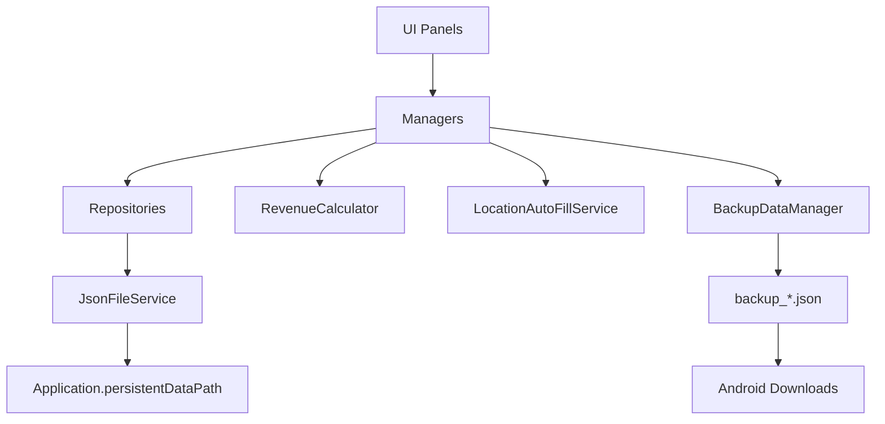

# 기술 아키텍처

## 전체 구조

## 계층별 책임

### Data

- `DeliveryRecord`
- `WorkSession`
- `SettlementRecord`
- `AppSettings`
- `PricingRule`
- Enum 정의

### Services

- `JsonFileService`: JSON 직렬화·역직렬화와 저장 경로 구성
- `RevenueCalculator`: 수입·비용·부가세·실수령 계산
- `LocationAutoFillService`: Android 위치와 주소 자동 입력

### Repositories

- `DeliveryRepository`: `delivery_records.json`
- `WorkSessionRepository`: `work_sessions.json`
- `SettingsRepository`: `app_settings.json`

### Managers

- `DeliveryManager`: 배송 CRUD, 기간 조회, 요약, 누락 고정비 생성
- `WorkSessionManager`: 근무 세션 저장과 근무시간 계산
- `SettlementManager`: 정산 요약
- `BackupDataManager`: 전체 백업·복원·내보내기
- `AppFlowManager`, `UIManager`: 패널 전환과 앱 흐름

### UI

- `HomePanelUI`
- `DeliveryInputPanelUI`
- `DeliveryListPanelUI`
- `StatsPanelUI`
- `CalendarPanelUI`
- `SettlementPanelUI`
- `MonthlySummaryCardUI`
- `SettingsPanelUI`

## 책임 분리

UI는 입력과 표시를 담당하고, 계산은 Service, 업무 규칙은 Manager, 파일 저장은 Repository와 `JsonFileService`가 담당합니다. 이 구조를 통해 화면 수정과 데이터 처리 로직을 분리했습니다.
