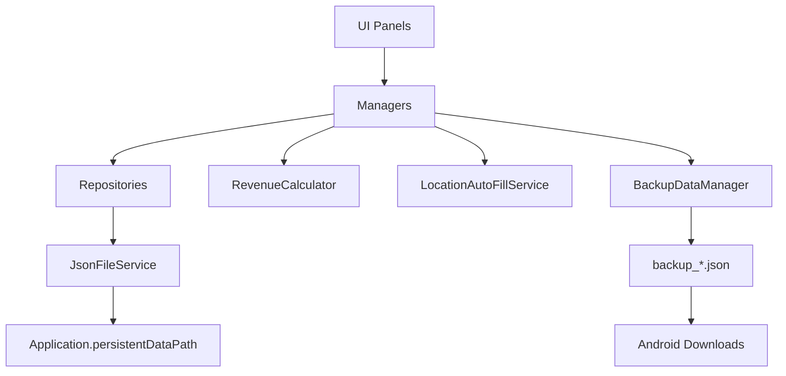

# 02. 시스템 아키텍처

## 전체 구조

UI에서 입력받은 배송·근무 정보는 Manager에서 업무 규칙을 적용한 뒤 Repository와 `JsonFileService`를 통해 JSON 파일로 저장합니다. 계산은 `RevenueCalculator`, 위치 입력은 `LocationAutoFillService`, 전체 백업·복원은 `BackupDataManager`가 담당합니다.

## 주요 구성 요소

| 구성 요소 | 역할 |
|:---|:---|
| `AppFlowManager` | 앱 초기화와 주요 화면 흐름 관리 |
| `UIManager` | 하단 메뉴와 패널 전환 관리 |
| `DeliveryManager` | 배송 기록 생성·조회·수정·삭제, 기간 조회와 누락 고정비 생성 |
| `WorkSessionManager` | 근무 시작·종료, 근무 세션 저장과 시간 계산 |
| `SettlementManager` | 선택 연도의 월별 정산 데이터 집계 |
| `BackupDataManager` | 전체 백업 생성, 파일 복원과 Android 다운로드 내보내기 |
| `RevenueCalculator` | 총수입·총비용·부가세·실수령 계산 |
| `LocationAutoFillService` | Android 위치 권한과 주소 자동 입력 처리 |
| `SettlementPanelUI` | 연도 이동, 정산 새로고침과 백업 패널 제어 |
| `MonthlySummaryCardUI` | 1월부터 12월까지의 월별 요약 카드 표시 |
| `SettlementPanelEditModeBuilder` | 정산 패널 레이아웃과 12개 카드 참조 구성 |

## 계층별 역할

| 계층 | 주요 파일 | 역할 |
|:---|:---|:---|
| Data | `DeliveryRecord`, `WorkSession`, `SettlementRecord`, `AppSettings`, `PricingRule` | 앱에서 사용하는 데이터 구조와 상태 정의 |
| Services | `JsonFileService`, `RevenueCalculator`, `LocationAutoFillService` | 파일 처리, 계산과 Android 위치 입력 |
| Repositories | `DeliveryRepository`, `WorkSessionRepository`, `SettingsRepository` | 데이터별 JSON 파일 저장과 불러오기 |
| Managers | `DeliveryManager`, `WorkSessionManager`, `SettlementManager`, `BackupDataManager` | 배송·근무·정산·백업 업무 규칙 수행 |
| UI | `HomePanelUI`, `DeliveryInputPanelUI`, `DeliveryListPanelUI`, `StatsPanelUI`, `CalendarPanelUI`, `SettlementPanelUI`, `SettingsPanelUI` | 사용자 입력, 화면 표시와 연결 화면 갱신 |
| Editor | `SettlementPanelEditModeBuilder` | 정산 화면의 정적 레이아웃과 Inspector 참조 구성 |

## 데이터 저장 구조

| 데이터 | 담당 구성 요소 | 저장 파일 |
|:---|:---|:---|
| 배송 기록과 일일 고정비 | `DeliveryRepository` | `delivery_records.json` |
| 근무 세션 | `WorkSessionRepository` | `work_sessions.json` |
| 앱 설정 | `SettingsRepository` | `app_settings.json` |
| 전체 백업 | `BackupDataManager` | `backup_*.json` |
| 기본 저장 위치 | `JsonFileService` | `Application.persistentDataPath` |
| Android 내보내기 | `BackupDataManager` | Android 다운로드 폴더 |

전체 백업은 배송 기록과 근무 세션을 하나의 파일로 구성합니다. 복원 후에는 누락된 일일 고정비를 다시 확인하고 홈·기록·통계·정산 화면을 갱신합니다.

## 설계 기준

- UI는 입력과 표시를 담당하고, 계산·업무 규칙·파일 저장을 각각 Service, Manager, Repository로 분리했습니다.
- 배송 기록과 일일 고정비는 같은 저장 구조를 사용하되 `IsDailyFixedExpense`로 구분합니다.
- 고정비는 비용 집계에는 포함하고 실제 배송 판정에서는 제외해 배송 건수와 비용의 의미를 분리했습니다.
- 배송 저장·수정·삭제와 백업 복원 후 연결된 홈·기록·통계·캘린더·정산 화면을 다시 갱신합니다.
- 월별 정산은 12개 `MonthlySummaryCardUI` 참조를 고정해 선택한 연도의 1월부터 12월까지 같은 배치로 표시합니다.
- Android 내부 저장, 다운로드 폴더 내보내기와 파일 선택 복원을 서로 다른 처리 흐름으로 분리했습니다.
- 실제 배송 주소, 금액 원본과 백업 JSON은 공개 저장소에 포함하지 않고 구조와 처리 방식만 문서화합니다.

---

[문서 목차](README.md) · [프로젝트 README](../README.md)
