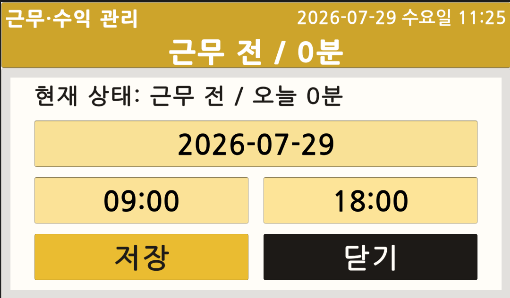

# 주요 기능

## 배송 기록

배송 기록은 출발지·도착지, 날짜·시간, 요금과 비용, 메모를 포함합니다. 입력값이 변경될 때 총수입·총비용·부가세·실수령을 다시 계산합니다.

  

실기기에서는 등록 완료 후 홈·기록·통계·정산 화면을 함께 갱신합니다.

| 입력 화면 | 등록 완료 | 수정·삭제 |
|---|---|---|
|  |  |  |

## 근무시간

근무 시작과 종료를 기록하고, 잘못 입력한 날짜·시간을 직접 수정할 수 있습니다.

| Unity 화면 | 실기기 화면 |
|---|---|
|  |  |

## 기록 목록과 부가세

오늘·주간·월간 기록을 날짜별로 정렬하고, 부가세 대상 기록은 별도의 월 단위 표로 표시합니다.

| 부가세 빈 상태 | 부가세 기록 |
|---|---|
|  |  |

## 통계

기간과 금액 범위를 조합해 배송 기록을 필터링하고 선택한 분석 항목의 합계를 표시합니다.

| 통계 요약 | 기간·금액 필터 | 실기기 통계 |
|---|---|---|
|  |  |  |

## 캘린더

월별 날짜 셀에 근무시간, 배송 건수, 수입·비용·실수령·부가세를 표시하고 선택한 날짜의 기록 목록으로 이동합니다.

| Unity 캘린더 | 실기기 캘린더 |
|---|---|
|  |  |

## 연도별 월 정산

연도를 이동하면서 12개월 요약을 확인합니다. 각 카드는 배송 건수, 총수입, 비용 분류와 실수령을 표시합니다.

| Unity 정산 | 실기기 정산 |
|---|---|
|  |  |

## 일일 고정비 보정

기준 시작일부터 오늘까지 날짜를 순회해 일일 고정비 레코드가 없는 날짜를 찾습니다. 배송이 없는 날에도 비용은 정산에 포함하되 배송 건수에서는 제외합니다.

## 백업·복원

배송 기록과 근무 세션을 하나의 `backup_*.json` 파일로 생성합니다. Android에서는 다운로드 폴더로 내보내고 파일 선택창을 통해 복원할 수 있습니다.
