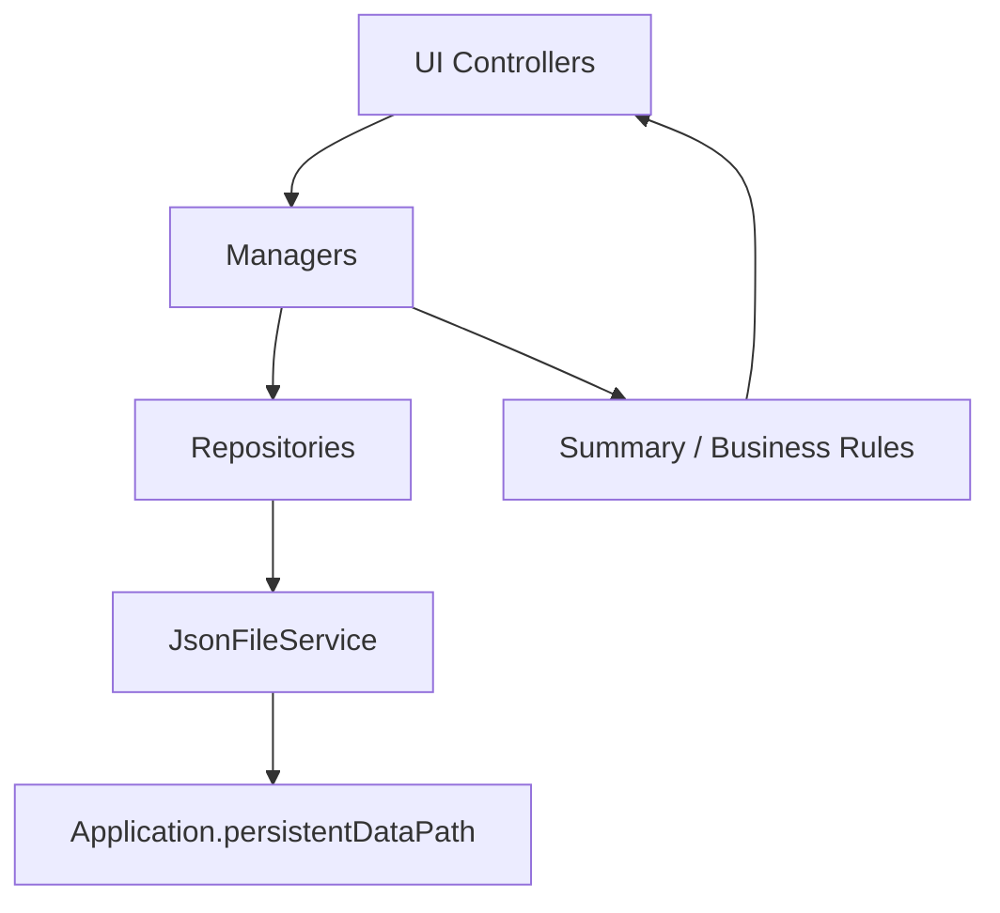
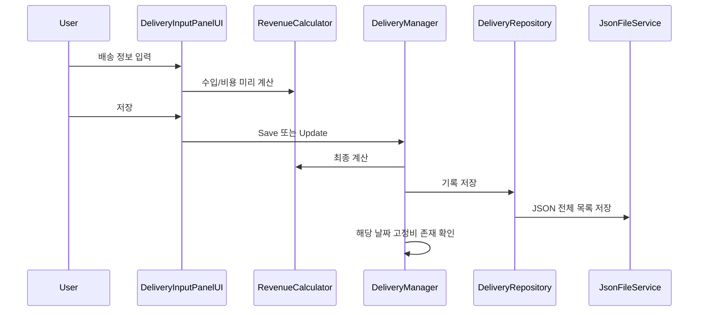

# 03. 기술 아키텍처

## 전체 구조

## 계층별 책임

### Data

- `DeliveryRecord`: 배송·수입·비용·정산 상태
- `WorkSession`: 날짜별 근무 시작·종료
- `AppSettings`: 언어, 위치 자동입력, 큰 글씨, 삭제 확인 등
- `SettlementRecord`: 정산 구간과 상태 모델

### Services

- `RevenueCalculator`: 수입·부가세·총비용·실수령액 계산
- `JsonFileService`: JSON 저장·불러오기·존재 확인·삭제
- `LocationAutoFillService`: 위치 권한, 현재 좌표, Android 주소 변환

### Repositories

- `DeliveryRepository`: `delivery_records.json` 목록 CRUD
- `WorkSessionRepository`: 근무기록 목록 저장·갱신
- `SettingsRepository`: 앱 설정 저장·초기화

### Managers

- `DeliveryManager`: 배송 CRUD, 날짜 조회, Summary, 고정비 보정
- `WorkSessionManager`: 근무 시작·종료·수정·시간 계산
- `BackupDataManager`: 전체 백업, Download 내보내기, 복원
- `UIManager`: 패널 활성 상태 전환
- `AppFlowManager`: 하단 내비게이션 이벤트 연결

### UI

- `HomePanelUI`: 근무 상태와 오늘·월간 요약
- `DeliveryInputPanelUI`: 입력·수정·실시간 계산
- `DeliveryListPanelUI`: 기록·부가세 동적 목록
- `StatsPanelUI`: 기간·금액 필터와 항목별 분석
- `CalendarPanelUI`: 월간 셀·주간 차트·선택일 요약
- `SettlementPanelUI`: 연도별 12개월 Summary와 백업 토글

## 배송 저장 흐름

## 월별 요약 흐름

`GetRecordsForMonth(year, month)` → `BuildSummary(records)` → `MonthlySummaryCardUI.Bind(...)`

Summary는 원본 레코드를 수정하지 않고 안전한 로컬 값으로 합계를 계산합니다. 일일 고정비는 배송 건수에서 제외되지만 비용과 실수령액에는 포함됩니다.

## UI 구성 원칙

- 기록·부가세·달력의 반복 항목은 런타임 생성
- 정산 화면은 앵커와 카드 배치를 쉽게 조정하도록 Edit Mode 고정 구조
- 다른 패널의 기존 런타임 구조는 정산 UI 변경에서 분리
