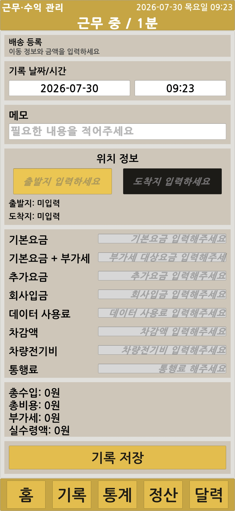
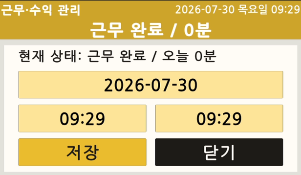
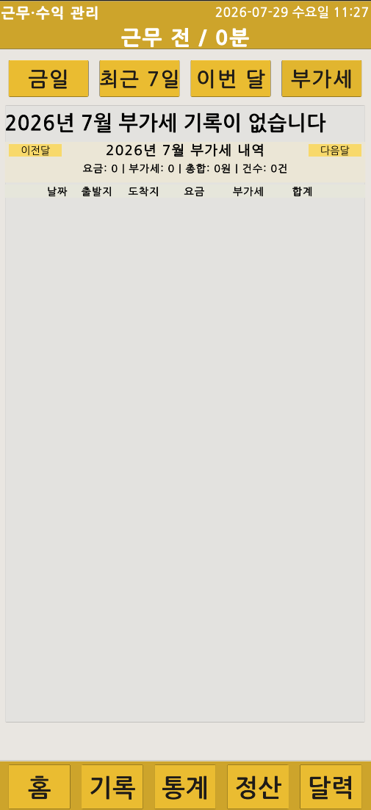
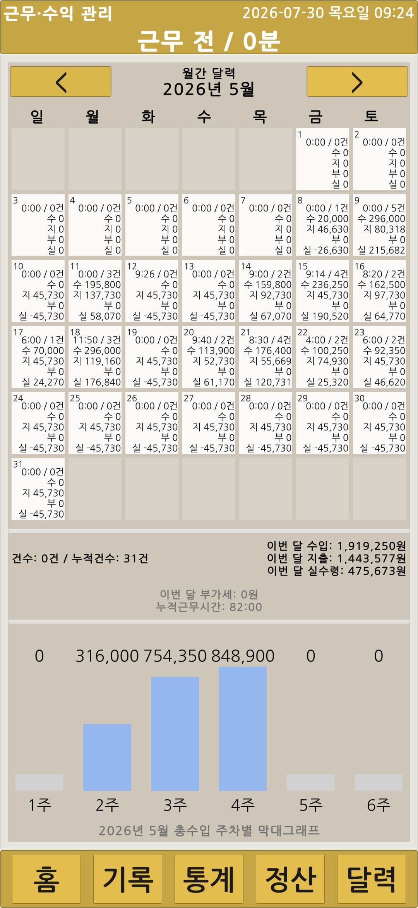
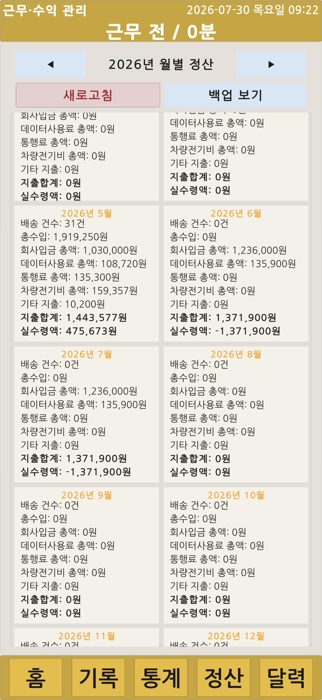
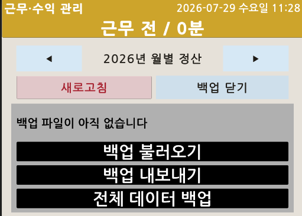

# 03. Features

## 배송 기록 관리

출발지·도착지, 날짜·시간, 기본 요금, 부가세 대상 금액, 추가 요금과 비용을 입력합니다. 입력값이 변경되면 `RevenueCalculator`를 통해 총수입, 총비용, 부가세와 실수령을 다시 계산합니다.

저장된 기록은 기존 식별자를 유지한 상태로 수정하거나 삭제할 수 있으며, 처리 후 홈·기록·통계·캘린더·정산 화면을 갱신합니다.

  

<table>
  <tr>
    <td width="50%" align="center"></td>
    <td width="50%" align="center"></td>
  </tr>
  <tr>
    <td align="center">배송 기록 입력</td>
    <td align="center">배송 등록 완료</td>
  </tr>
</table>

<table>
  <tr>
    <td width="50%" align="center"></td>
    <td width="50%" align="center"></td>
  </tr>
  <tr>
    <td align="center">최근 배송 기록</td>
    <td align="center">기존 기록 수정·삭제</td>
  </tr>
</table>

## 근무시간 관리

근무 시작과 종료를 기록하고, 잘못 입력한 날짜와 시간을 직접 수정할 수 있습니다. 저장된 근무 세션은 홈 요약, 기간 통계와 캘린더의 근무시간 계산에 반영됩니다.

<table>
  <tr>
    <td width="50%" align="center"></td>
    <td width="50%" align="center"></td>
  </tr>
  <tr>
    <td align="center">근무시간 수정</td>
    <td align="center">Android 실기기 근무시간 설정</td>
  </tr>
</table>

## 기록 목록과 부가세

오늘·주간·월간 배송 기록을 날짜 기준으로 조회합니다. 부가세 대상 기록은 일반 기록과 구분해 월별 목록과 합계로 표시합니다.

<table>
  <tr>
    <td width="50%" align="center"></td>
    <td width="50%" align="center"></td>
  </tr>
  <tr>
    <td align="center">부가세 기록 없음</td>
    <td align="center">부가세 대상 기록</td>
  </tr>
</table>

## 기간·금액 통계

오늘·주간·월간·연간·전체·직접 기간을 기준으로 배송 건수, 수입, 비용과 실수령을 집계합니다. 기간 조건과 함께 최소·최대 금액 조건을 적용해 대상 기록을 필터링할 수 있습니다.

<table>
  <tr>
    <td width="50%" align="center"></td>
    <td width="50%" align="center"></td>
  </tr>
  <tr>
    <td align="center">기간별 통계 요약</td>
    <td align="center">기간·금액 조건 필터</td>
  </tr>
</table>

  

## 캘린더 분석

월간 캘린더의 날짜 셀에 근무시간, 배송 건수, 수입, 비용, 실수령과 부가세를 표시합니다. 날짜를 선택하면 해당 날짜의 배송 기록 목록으로 이동하며, 주간 차트로 선택 기간의 흐름을 함께 확인합니다.

<table>
  <tr>
    <td width="50%" align="center"></td>
    <td width="50%" align="center"></td>
  </tr>
  <tr>
    <td align="center">월간 캘린더 분석</td>
    <td align="center">Android 실기기 캘린더</td>
  </tr>
</table>

## 연도별 월 정산

이전·다음 연도로 이동하면서 선택한 연도의 1월부터 12월까지 월별 정산을 확인합니다. 고정된 12개 `MonthlySummaryCardUI`에는 배송 건수, 총수입, 비용 항목과 실수령을 표시합니다.

<table>
  <tr>
    <td width="50%" align="center"></td>
    <td width="50%" align="center"></td>
  </tr>
  <tr>
    <td align="center">연도별 12개월 정산</td>
    <td align="center">Android 실기기 월 정산</td>
  </tr>
</table>

## 일일 고정비 보정

기준 시작일부터 오늘까지 날짜를 순회해 `IsDailyFixedExpense` 레코드가 없는 날짜를 찾습니다. 누락된 날짜에는 일일 고정비 레코드를 생성하고 전체 목록을 저장합니다.

고정비 레코드는 비용과 실수령 계산에는 포함하지만 실제 배송 건수에서는 제외합니다. 이를 통해 배송이 없는 날짜의 비용 누락을 막으면서 배송 건수 통계의 의미를 유지합니다.

## JSON 백업·복원

배송 기록과 근무 세션을 하나의 `backup_*.json` 파일로 생성합니다. 생성된 백업은 앱 내부 저장소에 유지하며 Android 다운로드 폴더로 내보낼 수 있습니다.

복원할 때는 파일 선택창에서 `backup_*.json` 파일을 선택합니다. 복원 후에는 누락된 일일 고정비를 다시 확인하고 홈·기록·통계·캘린더·정산 화면을 갱신합니다.

  

---

[문서 목차](README.md) · [프로젝트 README](../README.md)
