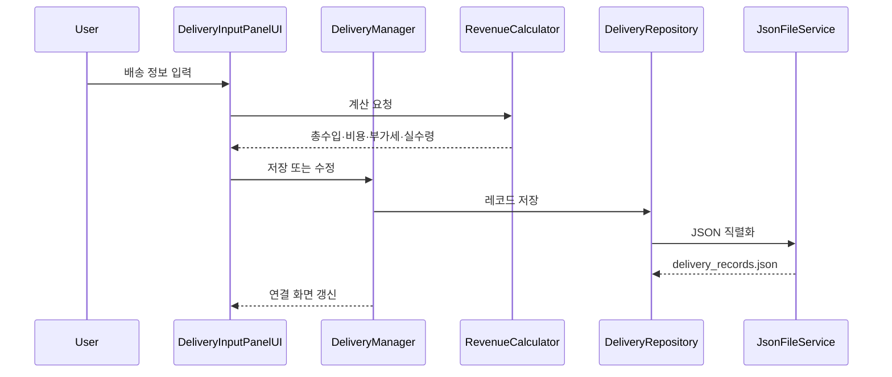
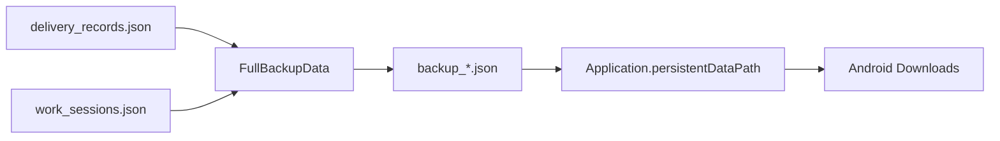

# 데이터 흐름

## 배송 저장

## 고정비 보정

1. 기준 시작일부터 오늘까지 날짜를 순회합니다.
2. 기존 `IsDailyFixedExpense` 레코드의 날짜를 수집합니다.
3. 누락된 날짜에 고정비 레코드를 추가합니다.
4. 전체 목록을 한 번 저장합니다.
5. 실제 배송 판정에서는 고정비 레코드를 제외합니다.

## 월별 정산

1. 선택 연도의 월별 배송 기록을 조회합니다.
2. 각 월의 `DeliverySummary`를 생성합니다.
3. 12개 `MonthlySummaryCardUI`에 바인딩합니다.
4. 연도 이동 또는 새로고침 시 다시 집계합니다.

## 백업

## 복원

선택한 백업 파일을 읽어 배송 기록과 근무 세션을 저장하고, 누락 고정비를 다시 확인한 후 홈·기록·통계·정산 화면을 갱신합니다.

## 공개 데이터 원칙

실제 기기에서 생성된 JSON 원본과 배송 주소·금액·메모는 저장소에 포함하지 않습니다. 공개 문서는 필드와 처리 구조만 설명합니다.
