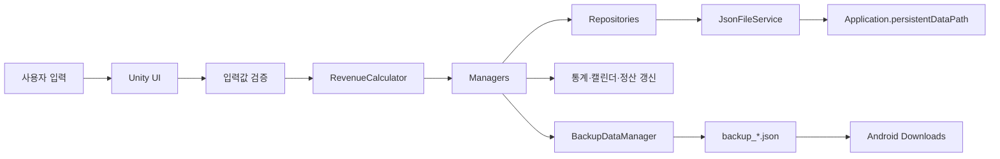
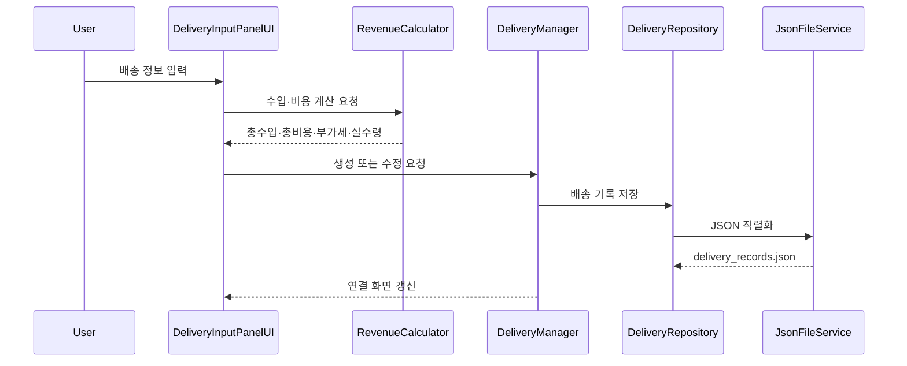
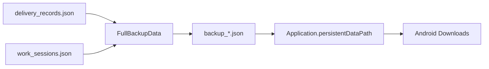

# 04. 데이터 흐름

## 전체 데이터 흐름

사용자가 입력한 배송·근무 정보는 UI에서 형식을 확인한 뒤 계산과 업무 규칙을 거쳐 Repository에 전달됩니다. Repository는 `JsonFileService`를 통해 Android 기기 내부 JSON 파일에 저장하고, Manager는 연결된 통계·캘린더·정산 화면을 갱신합니다.

## 사용자 입력

| 입력 영역 | 주요 입력값 | 처리 대상 |
|:---|:---|:---|
| 배송 기록 | 출발지·도착지, 날짜·시간, 기본 요금, 추가 요금, 비용, 부가세 대상 금액 | `DeliveryRecord` |
| 근무시간 | 근무 시작·종료, 수정 날짜와 시간 | `WorkSession` |
| 통계 | 기간 구분, 시작·종료일, 최소·최대 금액 | 배송 기록 필터와 합계 |
| 캘린더 | 조회 연·월, 선택 날짜 | 일별 요약과 기록 목록 |
| 월 정산 | 이전·다음 연도, 새로고침 | 월별 `DeliverySummary` |
| 백업 | 생성, 내보내기, 파일 선택 복원 | `FullBackupData` |

## 데이터 검증과 계산

배송 입력 화면은 필수 입력값과 숫자 형식을 확인한 뒤 `RevenueCalculator`를 통해 총수입, 총비용, 부가세와 실수령을 계산합니다.

수정 작업에서는 기존 배송 기록의 식별자를 유지하고 변경된 입력값을 다시 계산합니다. 삭제 작업 이후에도 동일하게 연결 화면을 새 데이터 기준으로 갱신합니다.

## 메모리 데이터 반영

Manager와 Repository가 사용하는 기록 목록은 홈·기록·통계·캘린더·정산 UI의 공통 기준이 됩니다.

| 변경 작업 | 반영 화면 |
|:---|:---|
| 배송 기록 생성·수정·삭제 | 홈, 배송 목록, 통계, 캘린더, 월 정산 |
| 근무 세션 시작·종료·수정 | 홈, 통계, 캘린더 |
| 누락 고정비 생성 | 통계, 캘린더, 월 정산 |
| 백업 복원 | 홈, 배송 목록, 통계, 캘린더, 월 정산 |

## JSON 파일 저장

`JsonFileService`는 파일명을 `Application.persistentDataPath`와 결합해 실제 저장 경로를 구성합니다. 각 Repository는 담당 데이터만 직렬화·역직렬화합니다.

| 저장 데이터 | Repository | 파일 |
|:---|:---|:---|
| 배송 기록과 일일 고정비 | `DeliveryRepository` | `delivery_records.json` |
| 근무 세션 | `WorkSessionRepository` | `work_sessions.json` |
| 앱 설정 | `SettingsRepository` | `app_settings.json` |

저장된 JSON은 앱을 다시 실행했을 때 Repository가 불러와 Manager와 UI에서 사용하는 데이터로 반영합니다.

## 일일 고정비 보정

1. 기준 시작일부터 오늘까지 날짜를 순회합니다.
2. 기존 기록 중 `IsDailyFixedExpense`가 설정된 날짜를 수집합니다.
3. 일일 고정비 레코드가 없는 날짜를 찾습니다.
4. 누락된 날짜에 고정비 레코드를 생성합니다.
5. 전체 배송 기록 목록을 한 번 저장합니다.
6. 실제 배송 건수 집계에서는 고정비 레코드를 제외합니다.

이 처리는 앱을 실행하지 않았던 날짜의 비용을 정산에 포함하면서, 고정비가 배송 건수로 계산되는 문제를 방지합니다.

## 월별 정산 계산

1. 사용자가 이전·다음 연도로 이동하거나 정산 새로고침을 실행합니다.
2. 선택한 연도의 배송 기록을 월별로 구분합니다.
3. 월별 배송 건수, 총수입, 비용 항목과 실수령을 집계합니다.
4. 1월부터 12월까지 12개의 `MonthlySummaryCardUI`에 결과를 바인딩합니다.
5. 배송 기록 또는 고정비 데이터가 변경되면 정산 화면을 다시 갱신합니다.

## 백업 생성과 내보내기

`BackupDataManager`는 배송 기록과 근무 세션을 하나의 전체 백업으로 구성합니다. 생성된 백업 파일은 앱 내부 저장소에 기록하며, 최신 백업을 Android 다운로드 폴더로 내보낼 수 있습니다.

## 백업 복원과 재실행

1. Android 파일 선택창에서 `backup_*.json` 파일을 선택합니다.
2. 선택한 백업의 배송 기록과 근무 세션을 각각 저장합니다.
3. 기준 시작일부터 오늘까지 누락된 일일 고정비를 다시 확인합니다.
4. 홈·기록·통계·캘린더·정산 화면을 새 데이터로 갱신합니다.
5. 앱을 다시 실행하면 내부 JSON 파일을 불러와 복원된 데이터를 유지합니다.

## 파일별 역할

| 파일 | 생성·관리 주체 | 역할 |
|:---|:---|:---|
| `delivery_records.json` | `DeliveryRepository` | 배송 기록과 일일 고정비 저장 |
| `work_sessions.json` | `WorkSessionRepository` | 근무 시작·종료와 수정 기록 저장 |
| `app_settings.json` | `SettingsRepository` | 위치 자동 입력, 글자 크기와 삭제 확인 설정 저장 |
| `backup_*.json` | `BackupDataManager` | 배송 기록과 근무 세션의 전체 백업 |
| Android 다운로드 파일 | `BackupDataManager` | 앱 외부 보관을 위한 최신 백업 내보내기 |

실제 배송 주소, 금액, 개인 메모와 백업 JSON 원본은 공개 저장소에 포함하지 않으며 문서에는 데이터 구조와 처리 흐름만 기록합니다.

---

[문서 목차](README.md) · [프로젝트 README](../README.md)
