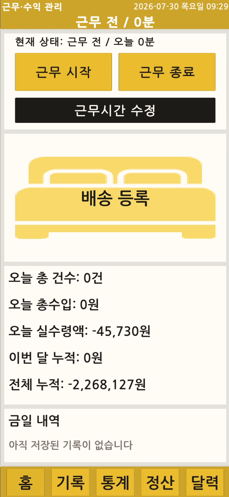
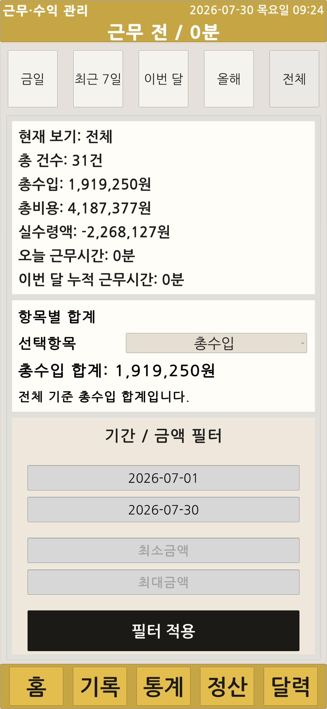
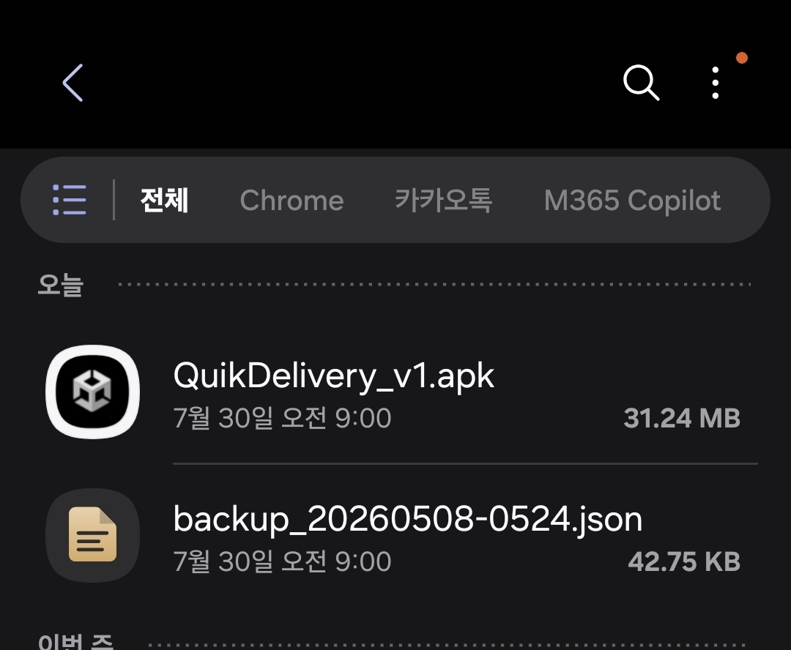

# 검증

## 기능 검증

| 검증 항목 | 결과 | 확인 내용 |
|---|---|---|
| MainScene 실행 | PASS | 홈과 하단 메뉴, 주요 패널 전환 |
| 배송 등록 | PASS | 입력값 계산과 JSON 저장 |
| 배송 수정·삭제 | PASS | 기존 ID 유지 수정, 삭제 후 화면 갱신 |
| 근무 세션 | PASS | 시작·종료와 날짜·시간 수동 보정 |
| 기간 통계 | PASS | 오늘·주간·월간·연간·전체·직접 기간 |
| 금액 필터 | PASS | 최소·최대 금액 조건 적용 |
| 캘린더 | PASS | 일별 요약, 주간 차트, 날짜 선택 |
| 부가세 | PASS | 대상 기록과 월별 합계 |
| 월 정산 | PASS | 연도 이동과 12개월 카드 |
| 누락 고정비 | PASS | 기준일부터 오늘까지 누락일 자동 추가 |
| 전체 백업 | PASS | 배송·근무 데이터를 `backup_*.json`으로 생성 |
| 복원 | PASS | 백업 파일 선택 후 데이터와 화면 갱신 |
| 다운로드 내보내기 | PASS | Android 다운로드 폴더에서 파일 확인 |
| 실기기 실행 | PASS | APK 설치 후 주요 기능 흐름 확인 |

## Android 실기기 근거

| 홈 화면 | 배송 입력 | 통계 |
|---|---|---|
|  |  |  |

| 월 정산 | 캘린더 | APK·백업 파일 |
|---|---|---|
|  |  |  |

## 검증 제한

자동화된 단위·통합 테스트 결과는 포함하지 않습니다. 현재 검증은 Unity Play Mode와 Android 실기기 시나리오를 중심으로 기록했습니다.
