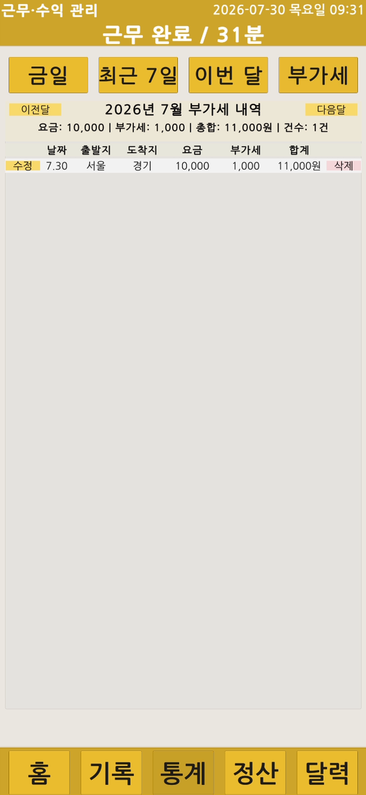

# Android 실기기 시연

Android 기기에 APK를 설치하고 배송 기록부터 통계·정산·백업까지 주요 사용 흐름을 확인했습니다.

## 시연 범위

- 홈 대시보드와 근무 상태 확인
- 근무 시작·종료와 날짜·시간 설정
- 배송 기록 입력과 등록
- 기존 배송 기록 수정·삭제
- 기간·금액 통계
- 연도별 12개월 월 정산
- 부가세 대상 기록
- 월간 캘린더 분석
- 백업 파일 생성과 Android 다운로드 폴더 확인

## 시연 영상

https://github.com/user-attachments/assets/52ec2404-edb2-441d-b28f-89d596c0a819

## 화면 자료

<table>
  <tr>
    <td width="50%" align="center"></td>
    <td width="50%" align="center"></td>
  </tr>
  <tr>
    <td align="center">홈 대시보드</td>
    <td align="center">근무시간 설정</td>
  </tr>
</table>

<table>
  <tr>
    <td width="50%" align="center"></td>
    <td width="50%" align="center"></td>
  </tr>
  <tr>
    <td align="center">배송 기록 입력</td>
    <td align="center">배송 등록 완료</td>
  </tr>
</table>

<table>
  <tr>
    <td width="50%" align="center"></td>
    <td width="50%" align="center"></td>
  </tr>
  <tr>
    <td align="center">배송 기록 수정·삭제</td>
    <td align="center">기간·금액 통계</td>
  </tr>
</table>

<table>
  <tr>
    <td width="50%" align="center"></td>
    <td width="50%" align="center"></td>
  </tr>
  <tr>
    <td align="center">연도별 월 정산</td>
    <td align="center">부가세 대상 기록</td>
  </tr>
</table>

  

  

영상과 화면 자료는 실제 배송 주소, 개인 메모와 수입 원본 데이터가 노출되지 않도록 정리한 공개용 자료입니다.

---

[문서 목차](../README.md) · [프로젝트 README](../../README.md)
