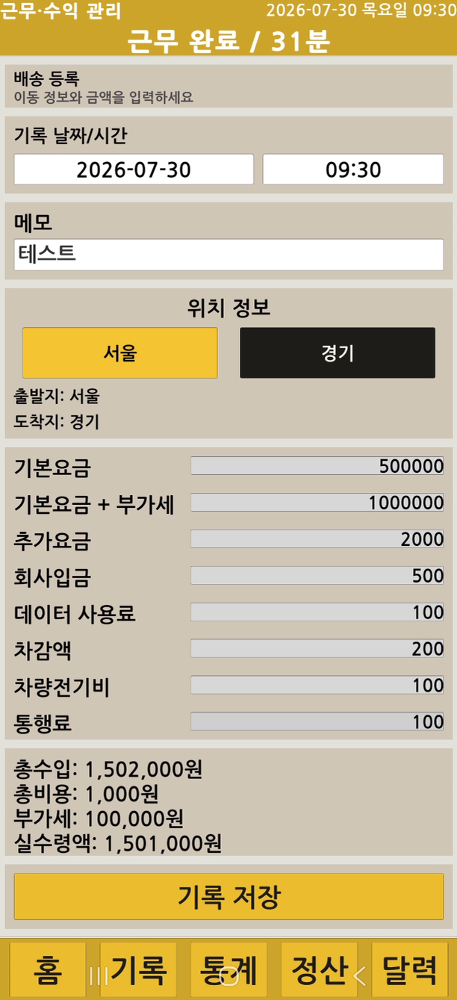
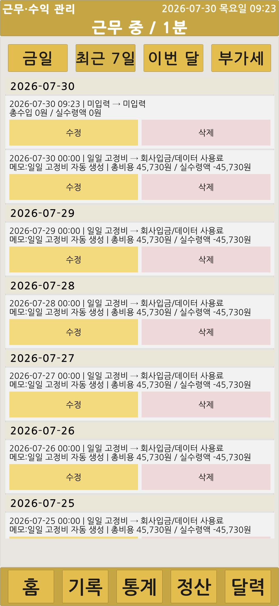

# Android 실기기 시연

Android 기기에 APK를 설치하고 다음 흐름을 확인했습니다.

- 홈 대시보드와 근무 상태
- 배송 기록 입력·등록
- 배송 기록 수정·삭제
- 기간 통계
- 캘린더 분석
- 연도별 월 정산
- 부가세 기록
- 백업 파일 생성과 다운로드 폴더 확인

https://github.com/user-attachments/assets/52ec2404-edb2-441d-b28f-89d596c0a819

## 화면 자료

| 홈 | 근무시간 | 배송 입력 |
|---|---|---|
|  |  |  |

| 등록 완료 | 수정·삭제 | 통계 |
|---|---|---|
|  |  |  |

| 월 정산 | 부가세 | 캘린더 |
|---|---|---|
|  |  |  |

  

영상과 화면은 개인정보와 실제 배송 주소가 노출되지 않도록 편집한 공개용 자료만 사용합니다.
